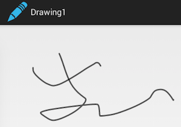
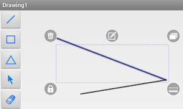

# AndroidDrawing

培训用的样例，基于 [TouchVG][vgandroid] 构建矢量绘图应用。

## 练习1：超简单的涂鸦App

准备工作：安装 ADT Bundle 开发环境（我用的是v23，官方下载被墙，可从[这][ADT]下载）。

1. 新建 Android 程序项目。

   - SDK 最小版本选 API 16 以上（避免自动创建的 appcompat_v7 项目出现资源缺失错误），完成后可改回低版本（使用 TouchVG 要求最低 API 12）。
   - 在创建 Activity 页面选择默认的简单布局 Blank Activity。

2. 在主页面布局中添加一个 FrameLayout，将用作绘图区的容器。

   - 指定 ID 为 `container`，下面就可通过 `findViewById(R.id.container)`找到此布局。
   - 使用 FrameLayout 而不是其他布局类型做绘图视图容器，是避免触摸绘图引起其他相邻视图联锁刷新。

3. 添加 TouchVG 引用。

   - 下载[预编译的TouchVG包][prebuilt]，将 touchvg.jar 和 libtouchvg.so 复制到程序项目的 libs 下。
   
   - 如需调试进入 TouchVG 或快速查看 IViewHelper 接口注释，则不能复制touchvg.jar，可将 [TouchVG项目][vgproj] 复制到上级目录并导入TouchVG工程，在程序项目的 project.properties 中加入引用：
   `android.library.reference.1=../TouchVG`

4. 在 MainActivity.java 中创建绘图视图。

   - 定义 IViewHelper 对象，在 onCreate 中创建绘图视图。

     ```java
    public class MainActivity extends Activity {
         private IViewHelper mHelper = ViewFactory.createHelper();

         @Override
         protected void onCreate(Bundle savedInstanceState) {
             super.onCreate(savedInstanceState);
             setContentView(R.layout.activity_main);

             mHelper.createGraphView(this, (ViewGroup) this.findViewById(R.id.container));
             mHelper.setCommand("splines");
         }
     ```
   - 在 `createGraphView` 下一行的 `setCommand` 激活随手画命令。`splines` 是命令名，更多命令名见[在线文档][cmdnames]。

5. 运行程序，动手画画吧。

   

## 练习2：添加绘图按钮

1. 添加按钮布局和按钮图片。

   在 res/drawable 中添加五个按钮图片，在 res/layout 中添加按钮布局 button_bar.xml：

     ```xml
    <?xml version="1.0" encoding="utf-8"?>
    <LinearLayout xmlns:android="http://schemas.android.com/apk/res/android"
        android:layout_width="wrap_content"
        android:layout_height="fill_parent"
        android:orientation="vertical" >

        <ImageButton
            android:id="@+id/line_btn"
            android:layout_width="wrap_content"
            android:layout_height="wrap_content"
            android:src="@drawable/line" />

        <ImageButton
            android:id="@+id/rect_btn"
            android:layout_width="wrap_content"
            android:layout_height="wrap_content"
            android:src="@drawable/rect" />

        <ImageButton
            android:id="@+id/triangle_btn"
            android:layout_width="wrap_content"
            android:layout_height="wrap_content"
            android:src="@drawable/triangle" />

        <ImageButton
            android:id="@+id/select_btn"
            android:layout_width="wrap_content"
            android:layout_height="wrap_content"
            android:src="@drawable/select" />

        <ImageButton
            android:id="@+id/erase_btn"
            android:layout_width="wrap_content"
            android:layout_height="wrap_content"
            android:src="@drawable/eraser" />

    </LinearLayout>
     ```

   主界面布局 activity_main.xml：

     ```xml
    <LinearLayout xmlns:android="http://schemas.android.com/apk/res/android"
        xmlns:tools="http://schemas.android.com/tools"
        android:id="@+id/horzLayout"
        android:layout_width="match_parent"
        android:layout_height="match_parent"
        android:orientation="horizontal"
        tools:context="com.example.drawing1.MainActivity" >

        <include
            android:id="@+id/buttons_bar"
            layout="@layout/buttons_bar" />

        <FrameLayout
            android:id="@+id/container"
            android:layout_width="match_parent"
            android:layout_height="match_parent" >
        </FrameLayout>

    </LinearLayout>
     ```
   
2. 添加按钮响应，激活相应绘图命令。

     ```
    @Override
    protected void onCreate(Bundle savedInstanceState) {
        .....
        initButtons();
    }

    private void initButtons() {
        findViewById(R.id.line_btn).setOnClickListener(new OnClickListener() {
            @Override
            public void onClick(View v) {
                mHelper.setCommand("line");
            }
        });
        findViewById(R.id.rect_btn).setOnClickListener(new OnClickListener() {
            @Override
            public void onClick(View v) {
                mHelper.setCommand("rect");
            }
        });
        findViewById(R.id.triangle_btn).setOnClickListener(new OnClickListener() {
            @Override
            public void onClick(View v) {
                mHelper.setCommand("triangle");
            }
        });
        findViewById(R.id.select_btn).setOnClickListener(new OnClickListener() {
            @Override
            public void onClick(View v) {
                mHelper.setCommand("select");
            }
        });
        findViewById(R.id.erase_btn).setOnClickListener(new OnClickListener() {
            @Override
            public void onClick(View v) {
                mHelper.setCommand("erase");
            }
        });
    }
     ```

3. 再次运行程序，点按钮可绘制多种图形。但选择图形出来几个空的按钮。

   

4. 添加上下文按钮资源、本地化串资源。从[预编译的TouchVG包][prebuilt]中，将 res/drawable-hdpi、res/drawable-mdpi、res/values 合并到程序中。其中 res/values/strings.xml 不能直接复制文件，需要合并文字内容。

   

## 练习3：增加自动保存和恢复功能

目前重启程序或按Home键，返回程序后所绘图形会丢失。可以增加自动保存和恢复功能。

1. 在 AndroidManifest.xml 中增加 MOUNT_UNMOUNT_FILESYSTEMS 和 WRITE_EXTERNAL_STORAGE 权限，以便读写外部存储器。

2. 在 MainActivity 中实现 onDestroy、onPause、onSaveInstanceState、onRestoreInstanceState，分别调用 IViewHelper 中相似名称的函数。


[vgandroid]: https://github.com/rhcad/vgandroid
[prebuilt]: https://github.com/rhcad/vgandroid/archive/prebuilt.zip
[vgproj]: https://github.com/rhcad/vgandroid/tree/develop/TouchVG
[cmdnames]: http://touchvg.github.io/pages/Commands.html
[ADT]: http://tools.android-studio.org
